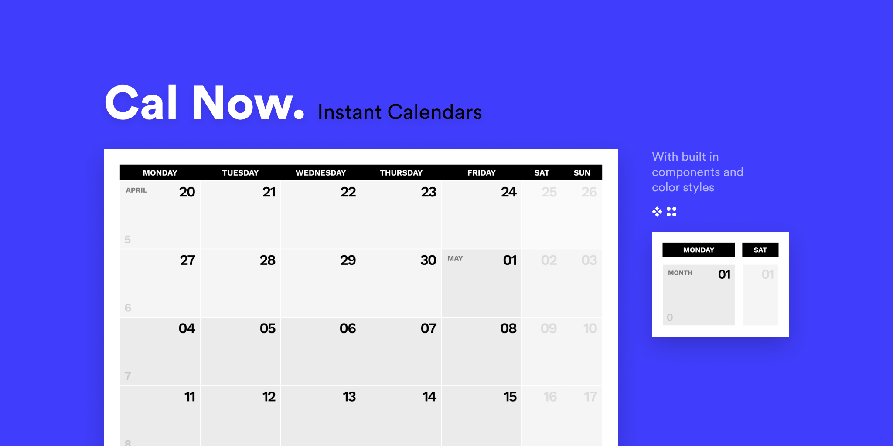

# Cal Now — Instant Calendars
Builds components and creates the calendar.

— Builds needed components & color styles
From here, you can change their size before you create a calendar. Make sure you keep the height the same for the respective weekend components if you don't want any gaps/overlaps in your calendar. 

— Creates the calendar
This will be based on the provided number of weeks and a starting date. It starts with a week 0, so keep that in mind! The easiest way to change background colors is through the new local styles. Just deselect any layer to see them. 

— Changed layer properties
It replaces the color style of the '#background' layer and changes the text of the layers '#month', '#day' and '#week'.